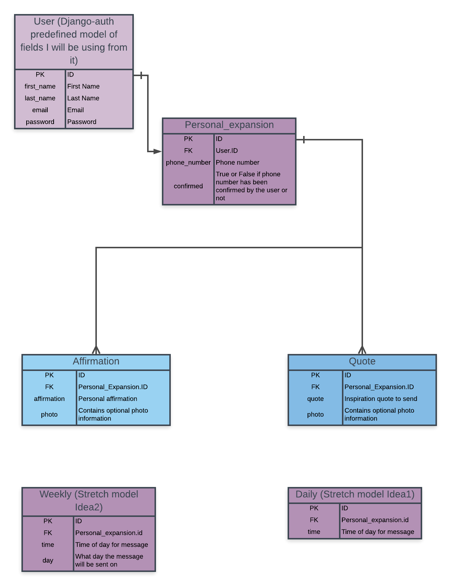

# Welcome To Assure Me!

## What is Assure me?

Assure Me is an app that helps people with their depression. Reports show that daily affirmations help people with their confidence and self-esteem. Sometimes people just need a little bit of validation. Users are able to insert a few things they like about themselves or perhaps something positive others have told them. Once a day they will recieve a text message to turn their thinking around with a personal affirmation of themselves.

## Live Site:

```
```

## Dependancies

This project is currently using:

1. Python
1. Django

To download a copy of this code for your own personal computer and get it running correctly, please follow along with these detailed steps.

<strong><em>
You must have the following installed:

Python version 3.7

Django Version 2.1.1

if you do not, feel free to install them in a virtual environment for now


</strong></em>
 
Open you terminal and input:

```
git clone https://github.com/CashewRose/Assure_Me.git

cd djangocap

python manage.py makemigrations Assure_Me

python manage.py migrate

python manage.py runserver
```

<em><strong>Congratulations! You should now have a working copy of this project! </strong></em>

- If you would like to play around and make adjustments in the code open a new terminal tab or window and start your editor! 

## Wirerame Representation: 

```
https://app.moqups.com/danieagnoletti@gmail.com/gvCwcMx1Q4/view
```

## Entity Relationship Diagram

